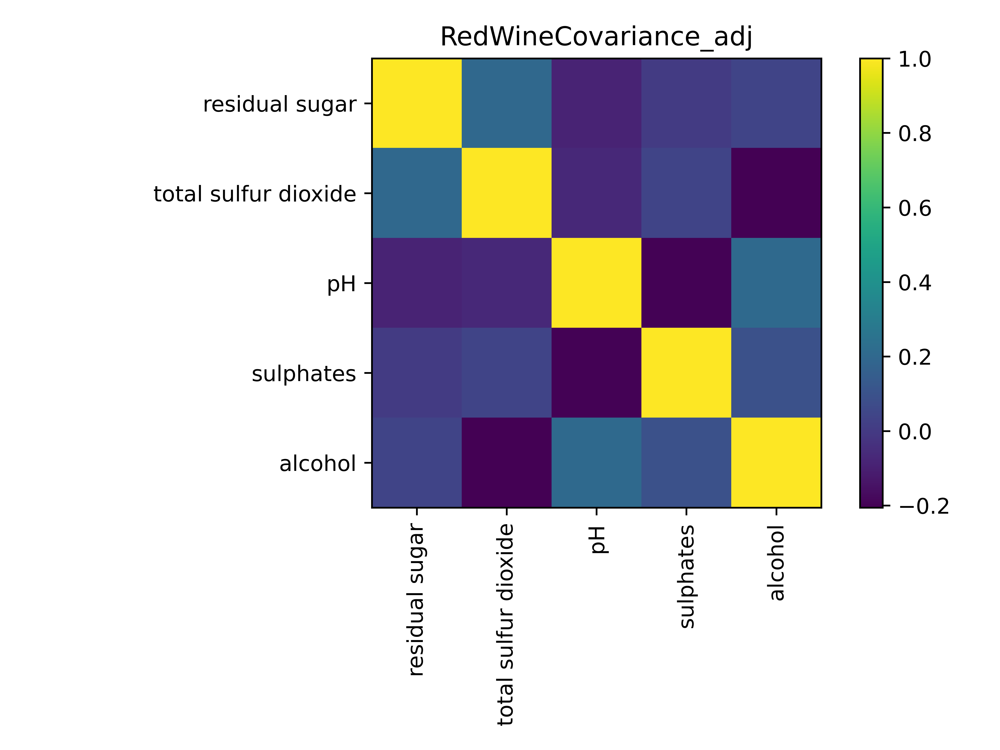

# Dimensional Reduction Analysis
In order to create a robust model, strongly correlated dimensions should be 
eliminated such that all dimensions represent indenpendent components.

One way to visualize this step is to create a covariance matrix which calculates
how to variables "co-vary". If two variables increase together their covariance
would be positive. If they had no _linear_ relationship the covariance will be
close to zero.

Different models are anticipated for red wine and white wine. Futhermore, the 
dimensional reduction analysis is also performed seperately.

## Red Wine Dim-Reduction
The dim_reduce.py script produced the following result

It is important to note that the variables were normalized
before the taking their covariance. This would not allow variables
with a larger dynamic range to create a fictious correlation.

The following variables are proposed to be removed
* free sulfur dioxide
* citric acid
* fixed acidity
* Volatile acidity
* chlorides
* Density (both alcohol and pH have strong correlations)

I am curious to see if the pH can cover the other three measures of acidity in
the model.

These changes produce the following covariance matrix

## Results from using linear regression
**Coefficient of determination**
* Least Squares 	: 0.259
* Ridge Regression 	: 0.259

The dimensionality reduction didn't pan out; the model did not capture a significant
portion of the variation of the data.

## Utilizing PCA and Linear Regression Together
**Coefficient of Determination**
* Least Squares 	: 0.33
* Ridge Regression 	: 0.33

Utilizting PCA reduction (90% threshold) did improve the variation captured but
the amount of variation captures is still low

## Utilizing Random Forest Model
**Model Accuracy**
* Random Forest : 65%

Although this is a higher percentage than the other regression models, the numbers
cannot be compared. One is a ratio of variances and the other is a ratio of correct
vs incorrect classifications.

## Improving the Random Forest Model

What the graph above is showing is that certain "classifications" are vastly 
out-numbered. Namely 2,3, and 8 have very small representation compared to 5 and 6
when it comes to quality. The common solution to this problem is something called
Synthetic Minority Oversampling Technique or SMOTE. Luckily, this has been already
implemented in a packaged called imbalanced learning. The answer from using SMOTE was
65%. This is not all that surprising since the model uses the principle components.
